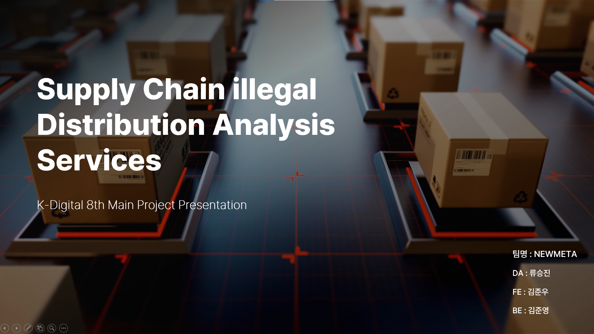
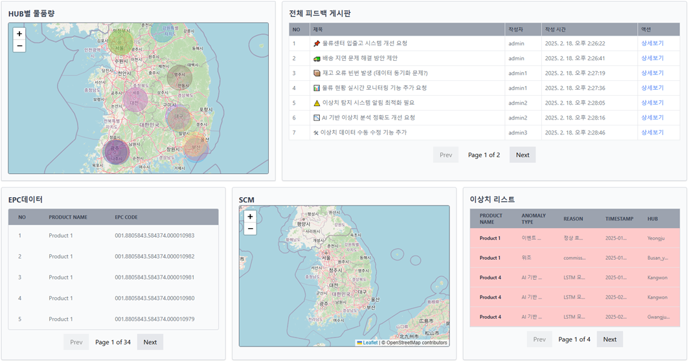
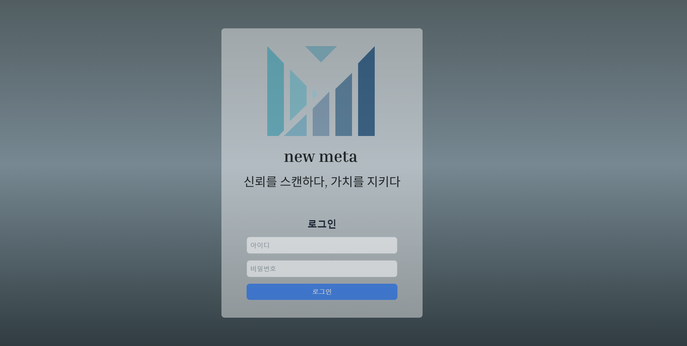
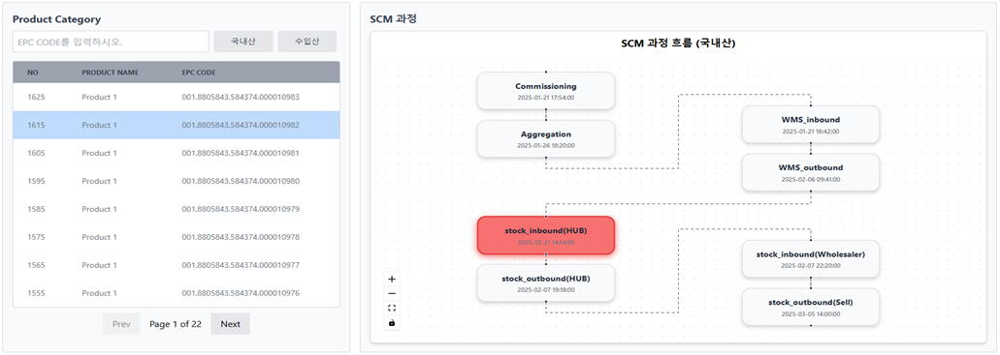
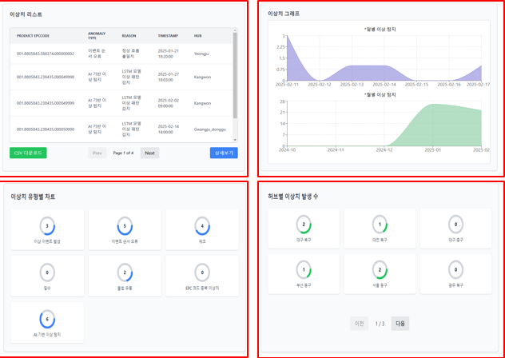
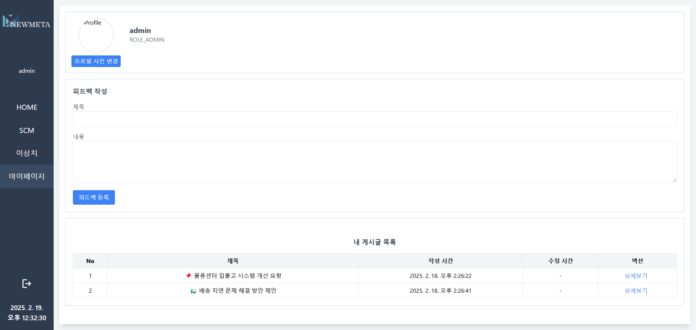

# NewMeta
🔎바코드 위조 및 일련번호 추적 시스템

 

## 프로젝트 소개

- 2014년 9월 11일 금연종합대책 발표 이후 담배 가격이 2,000원 인상되면서 바코드 위변조 및 불법 유통 사례가 매년 급증하고 있습니다. 담배뿐이 아니라 세계적으로 보았을때 많은 제품 공급과정에서 이러한 일들이 발생합니다.이러한 문제는 
 1. 데이터 신뢰성 저하 
 2. 매출손실 
 3. 유통과정에서 데이터 오류 및 불일치 문제
 4. 이상데이터 실시간 탐지를 대응하지 못하게 되는 문제점을 야기합니다.
 이러한 문제점을 해결하기 위해서 지능형 SCM위변조 탐지 시스템의 필요성을 느끼게 되어 NEWMETA 프젝트를 기획하게 되었습니다.

 

## 팀원 구성

| **김준우** | **류승진** | **김준영** |
| :------: | :------: | :------: |
| **FE** | **Data** | **BE** |
| [   @KIKJUNW0](https://github.com/KIKJUNW00) | [   @lenoau](https://github.com/lenoau) |[   @zeromile-000](https://github.com/zeromile-000) |

 

## 1. 개발 기간
- 전체 개발 기간 : 2025-01-13 ~ 2025-02-18

 

## 2. 개발 환경
- Front : React.js, HTML, CSS, JavaScript, Tailwind, React-flow
- Back-end : Springboot, MySQL
- Data : PyThon, Pytorch, FastAPI, Tensorflow, sklearn, keras
- 협업 툴 : Notion, Figma, Github

 

## 3. 역할 분담

### 👦김준우(FE)

- **기능**
    - React 기반 대시보드 UI/UX 설계 및 구현
    - 데이터 시각화 및 실시간 알림 기능 개발
    - Tailwind CSS 적용으로 반응형 웹 서비스 구현

 

### 🧑류승진(DATA)
- 데이터 전처리 및 특성공학 (Python, Pandas)
- 딥러닝 기반 이상 탐지 모델 개발 (PyTorch)
- 데이터 시각화 및 모델 성능 평가

 

### 👦김준영(BE)
- Spring Boot 기반 API 설계 및 데이터 처리
- MySQL 데이터베이스 연동 및 JPA 활용
- WebSocket을 이용한 실시간 데이터 송수신
- 이상치 탐지 규칙 설계 및 구현

 

## 4. 페이지별 기능

### [메인화면]
 

()

1. HUB별 물품량
 - 허브별 물품 수량에 따른 크기변화를 Buble Chart로 구현

2. 전체 피트백 게시판
 - 마이페이지 페이지에서 admin별 피드백 작성 후 모든 피드백 게시글 시각화 
 - 상세보기 클릭시 팝업창 생성 및 피드백 내용 시각화 (삭제불가)

3. EPC Code별 물품 
 - 물품 클릭시 SCM으로 중복 epc code의 위치정보 전달 후 지도 상위에 표시 및 시간 순서 번호 표시

4. 이상치 리스트
 - 메인 대시보드에서 임의로 볼 수 있는 모든 이상치 리스트

### [로그인]
 

- 회원ID와 비밀번호를 JWT토큰을 통해 인증 및 인가하여 로그인

### [물류관리]
 

1. 제품 카테고리
 - EPC Code를 검색하는 필터링기능구현
 - 국내산과 수입산 필터링 기능 구현
 - 게시글 개수 8개 제한 후 페이징
 - 클릭 이벤트 발생시 호버기능 
 - EPC Code를 React-flow 컴포넌트에 전달 중복된 EPC Code별 흐름 구현

2. SCM과정
 - React-flow 라이브러리를 사용해 애니메이션으로 흐름을 보이도록 구현
 - API 사용으로 데이터 형식이 ‘Is_anomaly : true’ 이면 플로우 차트에 붉게 표현
 - 이벤트 발생 별 시간 표시구현

### [이상치페이지]
 

1. Epc Code별 리스트
 - 모든 이상치를 확인가능
 - 이상치 이벤트 유형 및 이유, 발생시각, 발생장소 확인가능
 - 상세보기를 통해서 해결된 이상치 삭제기능구현
 - 이상치 csv파일 다운로드 기능구현

2. 이상치 발생량 그래프
 - 현재 날짜까지 7일간의 이상치 발생량 그래프
 - 최근 5달의 이상치 발생량 그래프

3. 이상치 유형별 Pie Chart 
 - 이상이벤트 발생, 이벤트 순서오류, 위조, 밀수, 불법유통, EPC코드 중복 이상치, AI기반 이상탐지 등 유형별 발생량 그래프

4. 허브위치별 이상치 발생 Pie Chart
 - 18곳의 HUB별 이상치 발생량 그래프 

### [마이페이지]
 

- 로그인된 회원별 글 저장
- 피드백 입력기능

## 5. 개발일지
 

- https://spark-area-969.notion.site/NewMeta-Project-17d4f559836480448914f922c060aff3?pvs=4

## 6. 시연영상
 

 - https://youtu.be/tFSZUSTrRZo?si=6l7s_HO2qHlYclfC

 ## 7. 발표자료
 

 - https://docs.google.com/presentation/d/1P4cP2yNFzzG4NG2Uh7SQQ_Irst0aEkC4/edit?usp=drive_link&ouid=105082396347888966096&rtpof=true&sd=true

## 8. 참고

 1. 불법 담배 제조 공장 적발‥13억 원 상당 유통(이미지)
 출처 : https://imnews.imbc.com/replay/2024/nw1400/article/6646850_36493.html
 
 2. <그래픽> 면세담배 불법 유통 개요(이미지)
 출처 : https://www.yna.co.kr/view/GYH20140825001500044

 3. LSTM기반의 오토인코더와 대조학습을 활용한 다변량 시계열 이상탐지 연구
 출처 : https://www.riss.kr/search/detail/DetailView.do?p_mat_type=be54d9b8bc7cdb09&control_no=66592a5217d5f20dffe0bdc3ef48d419&
 keyword=LSTM%20%EC%9D%B4%EC%83%81%20%ED%83%90%EC%A7%80
 장소라. "LSTM기반의 오토인코더와 대조학습을 활용한 다변량 시계열 이상탐지 연구." 국내석사학위논문 성균관대학교 일반대학원, 2024. 서울

 4. TensorFlow : 오토 인코더 개념참조
 출처 : https://www.tensorflow.org/tutorials/generative/autoencoder?hl=ko
 
 
 
